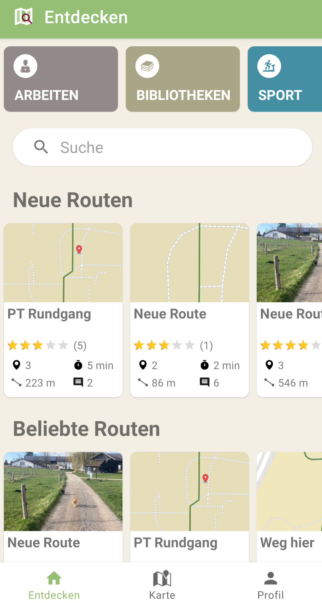
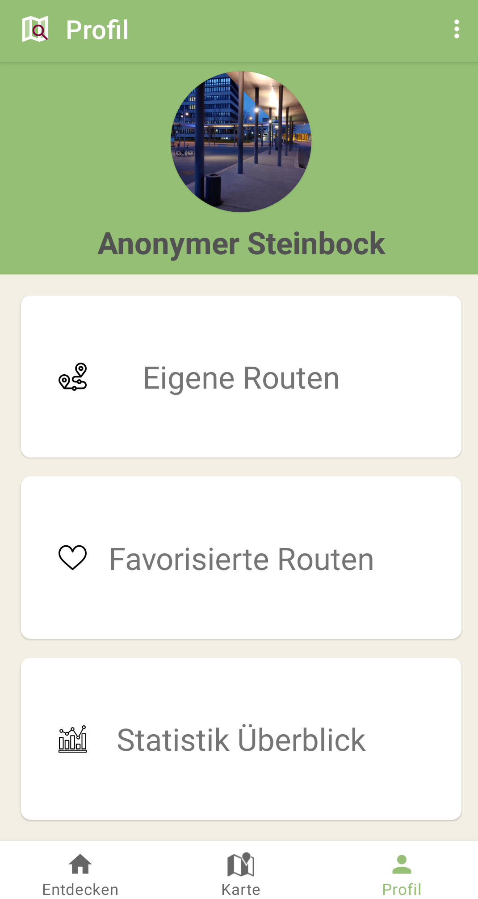
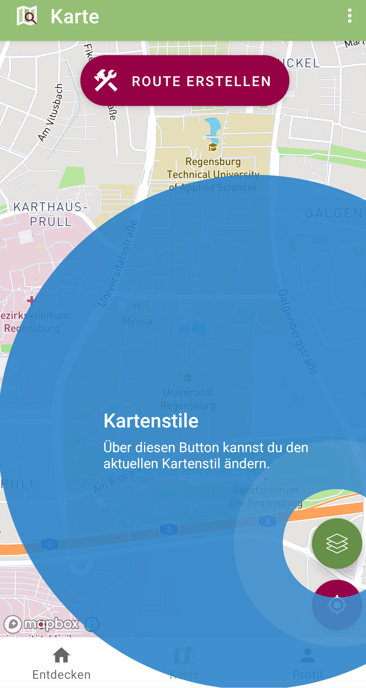
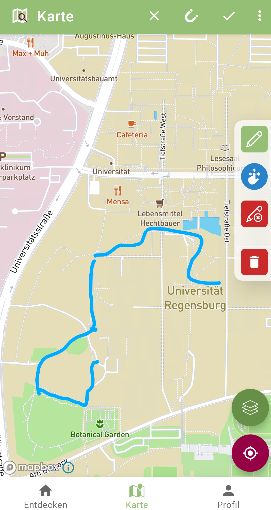
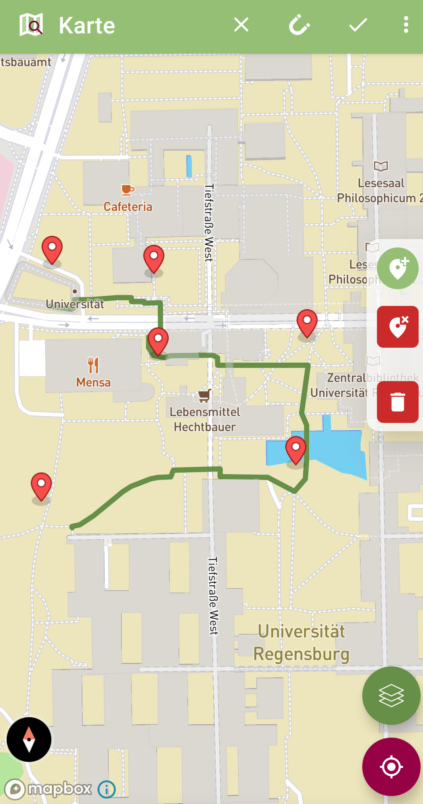
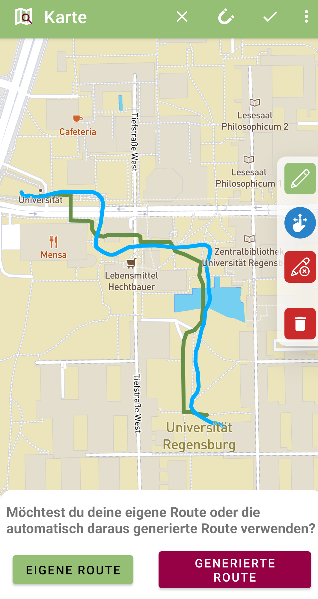
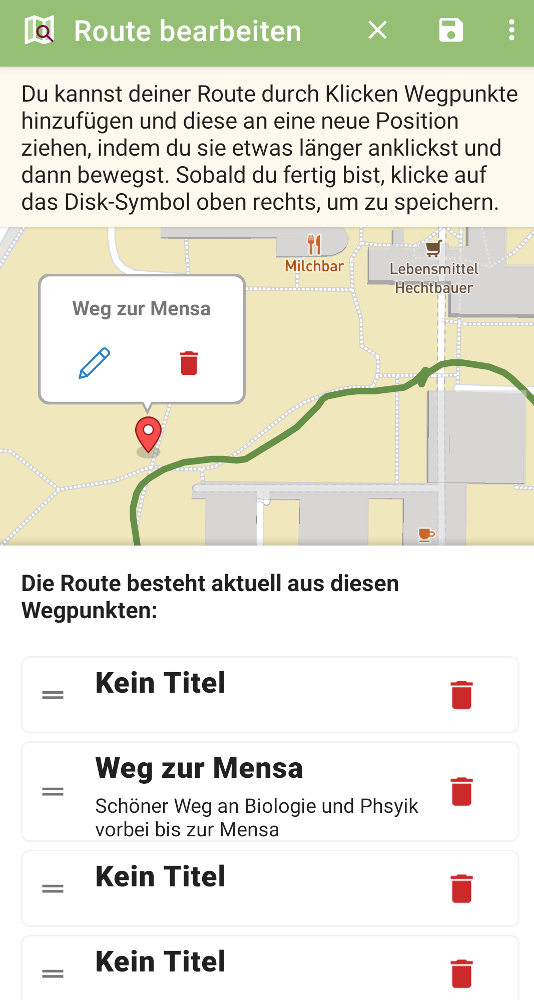
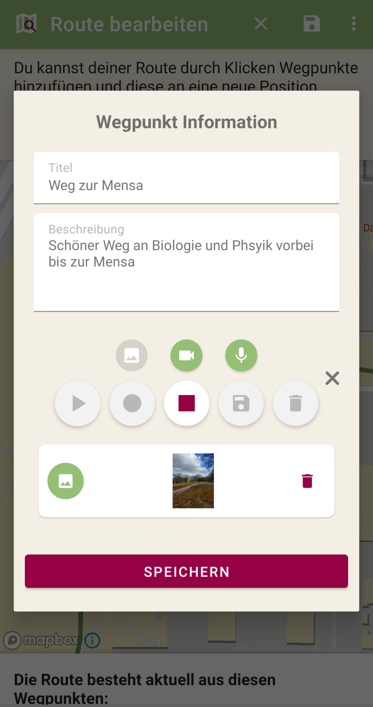
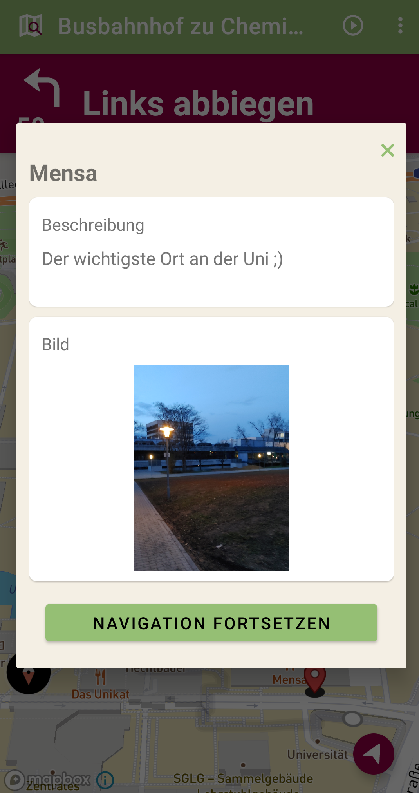

# ExplURe

## Überblick

*ExplURe* ist eine mobile Android-Anwendung zur Erstellung und Nutzung interaktiver
Entdeckungstouren am Campus der Universität Regensburg. NutzerInnen können über die App Routen aus POIs erstellen, die durch Text-, Bild-, Audio- oder Videoinformationen beschrieben werden. Routen können durch Begleitinformationen thematisch beschrieben und von anderen NutzerInnen recherchiert und gestartet werden. Dabei führt die Anwendung die NutzerInnen entlang der Route über den Campus und erlaubt das Kommentieren der Strecken bzw. Orte und das Teilen eigener Eindrücke.  

<!--

     

-->

| Startseite               | Karte                     | Profil
:-------------------------:|:-------------------------:|:-------------------------:
  |   |  

## Getting Started

**Die Anwendung steht aktuell (noch) nicht im Google Play Store zur Verfügung!**

Jedoch kann der aktuelle Release (siehe Releases hier im Repository) heruntergeladen und manuell auf einem Android-Smartphone installiert werden.

Altenativ kann der Quellcode auch heruntergeladen und lokal ausgeführt werden. Um die Android-Anwendung selbst lokal auszuführen, werden einige API-Keys benötigt:
Ein Algolia-API-Key, der jedoch **im Moment** bereits in diesem Repository enthalten ist und nicht selbst hinzugefügt werden muss.
Zum Anzeigen der Karte und für die Navigation sind 2 weitere Keys für Mapbox notwendig. Diese müssen zwangsläufig selbst mit einem eigenen (kostenlosen) Mapbox-Account generiert werden und als Variablen in Form von *gradle.properties* lokal hinterlegt werden. Der genaue Prozess ist in der [Hinweise zu Mapbox - Datei](./Hinweise_zu_Mapbox.md) beschrieben.

## Zentrale Features

### **Erstellen von Routen**

Der Prozess zur Erstellung eigener Routen besteht aus 3 Schritten:

1. Erstellen der Routenlinie auf der Karte
2. Hinzufügen und Bearbeiten von Wegpunkten mit zusätzlichen Informationen entlang der Route
3. Bearbeiten der Routeninformationen (Bild, Titel, Beschreibung, Kategorie, Dauer) und Speichern der Route

Das Erstellen der eigentlichen Routenlinie im ersten Schritt kann aktuell auf 2 verschiedene Weisen erfolgen:

* **durch direktes Einzeichnen auf der Karte**:

* **durch Platzieren von Markern auf der Karte**:

### **MapMatching**

Sowohl beim Zeichnen als auch beim Platzieren der Marker wird [*MapMatching*](https://docs.mapbox.com/help/glossary/map-matching-api/) verwendet, um die vom Nutzer erstellten Routenpunkte auf in [OpenStreetMap](https://www.openstreetmap.org/) bekannte Wege auf dem Campusgelände zu "mappen". Dabei wird jeder dieser Routenpunkte dem nächstgelegenen Punkt auf einem bekannten Weg zugeordnet. Da aber nur Fußwege benutzt werden können, können auch nur Routen im Außenbereich der Universität gefunden werden, wodurch sich teilweise Probleme ergeben, wenn die erstellte Route durch ein Gebäude führt. Um dieses Problem etwas abzuschwächen, wurde der Radius für das MapMatching für jeden Wegpunkt etwas erhöht (von standardmäßig 5 auf 15 Meter). Dadurch können auch in Punkte, die in Gebäuden platziert werden (zumindest wenn sie nicht zu weit innen liegen) trotzdem dem nächstgelegen Punkt außerhalb zugeordnet werden, auch wenn ein höherer Radius in der Regel zu etwas mehr Ungenauigkeiten führen kann. Beim Zeichnen der Route ist es jedoch auch möglich, seine eigene Route der automatisch durch *MapMatching* generierten vorzuziehen.
Da die Verwendung dieser API entsprechende Limits bei der Menge an gegebenen *LatLng*-Koordinaten mit sich bringt (100 Koordinaten-Paare), gerade beim freien Zeichnen einer Route auf der Karte aber in der Regel sehr viel mehr Koordinaten- Punkte erzeugt werden, wurde der im [Mapbox Geojson](https://docs.mapbox.com/android/java/guides/geojson/) - Modul bereits enthaltene [Ramer-Douglas-Peucker-Algorithmus](https://en.wikipedia.org/wiki/Ramer%E2%80%93Douglas%E2%80%93Peucker_algorithm) verwendet, um die Route zu vereinfachen und so die Menge an Routenpunkten zu reduzieren ohne die Geometrie (und damit den Verlauf) der Route großartig zu verändern.

### **Hinzufügen verschiedener Medien**

Für jeden erstellten Wegpunkt einer Route kann jeweils ein Bild, eine Audio- sowie eine Videodatei hochgeladen werden, um diesen Wegpunkt genauer zu beschreiben und so zusätzliche Informationen an beliebigen Punkten der Route hinterlegen zu können.

| Wegpunkte erstellen      | Wegpunkte bearbeiten
:-------------------------:|:-------------------------:
| 

### **Navigation entlang erstellter Routen**

Jede erstellte Route ist auf der *"Entdecken"*-Seite oder durch die Volltextsuche von allen Nutzern (auch für die, die keinen eigenen Account angelegt haben) mit zusätzlichen Informationen wie einer Beschreibung, ihren Wegpunkten und Kommentaren, der geschätzten Dauer und Länge sowie einem Routenbild einsehbar. Die Route kann dort ebenfalls nochmal auf der Karte angezeigt und eine Navigation entlang dieser gestartet werden. Dafür wird die Position des Nutzers benötigt. Während der Navigation erscheinen naheliegende Wegpunkte, die auch in einer Detailansicht mit den bereitgestellten Medien (wie Video oder Audio) angezeigt werden können.

## Technische Umsetzung

Die Android-App ist in Kotlin geschrieben, als Single-Activity-Architektur aufgebaut und folgt dem [MVVM-Pattern](https://en.wikipedia.org/wiki/Model%E2%80%93view%E2%80%93viewmodel) sowie aktuellen [*Best practices*](https://developer.android.com/jetpack/guide) für die Android - Entwicklung.
Zur Darstellung der Karte wird [Mapbox](https://www.mapbox.com/) verwendet.
Für das Backend wird [Google Firebase](https://firebase.google.com/?hl=en) verwendet, sowohl als Datenbank (Cloud Firestore und Cloud Storage) als auch für die Nutzer-Authentifizierung. Zur Volltextsuche wird zudem [Algolia](https://www.algolia.com/) eingesetzt. Als Dependency Injection - Framework wird [Koin](https://insert-koin.io/) verwendet.

Um eine hohe Code-Qualität im Team zu gewährleisten, wird [Detekt](https://detekt.github.io/detekt/) zur statischen Code-Analyse und der Einhaltung offizieller Style Guidelines eingesetzt (auch als lokaler pre-commit-hook implementiert). Detekt ist ebenfalls als [Github Action](./.github/workflows) in den Continuous Integration - Workflow integriert. Außerdem wurde während der Entwicklung [LeakCanary](https://square.github.io/leakcanary/) zum Auffinden und Beheben von Memory Leaks eingesetzt.

### Verwendete Komponenten und Bibliotheken

[Android Jetpack](https://developer.android.com/jetpack) - Komponenten:

* ViewBinding
* Navigation
* RecyclerView
* ViewModel
* LiveData
* Lifecycle

#### Third Party - Bibliotheken

* [Firebase Android SDK](https://firebase.google.com/docs/android/setup?hl=en)
* [Algolia Kotlin Client](https://github.com/algolia/algoliasearch-client-kotlin)
* [Mapbox Android Core SDK](https://docs.mapbox.com/android/core/guides/)
* [Mapbox Android Maps SDK](https://docs.mapbox.com/android/maps/guides/)
* [Mapbox Android Navigation SDK](https://docs.mapbox.com/android/navigation/guides/)
* [Mapbox Java SDK](https://docs.mapbox.com/android/java/guides/)
* [Mapbox Turf for Java](https://docs.mapbox.com/android/java/guides/turf/)
* [Mapbox Android Annotation Plugin](https://docs.mapbox.com/android/plugins/guides/annotation/)
* [Mapbox Android Building Plugin](https://docs.mapbox.com/android/plugins/guides/building/)
* [Detekt](https://github.com/detekt/detekt)
* [Timber](https://github.com/JakeWharton/timber)
* [LeakCanary](https://github.com/square/leakcanary/)
* [Sherlock](https://github.com/ajitsing/Sherlock)
* [Koin](https://github.com/InsertKoinIO/koin)
* [TapTargetView](https://github.com/KeepSafe/TapTargetView)
* [ViewBinding-Helpers](https://github.com/FunkyMuse/KAHelpers/tree/master/viewbinding)
* [Shimmer](https://github.com/facebook/shimmer-android)
* [AdapterDelegates](https://github.com/sockeqwe/AdapterDelegates)
* [Android View Animations](https://github.com/daimajia/AndroidViewAnimations)
* [Glide](https://github.com/bumptech/glide)
* [SlidingUp-Panel](https://github.com/umano/AndroidSlidingUpPanel)
* [AudioView](https://github.com/4eRTuk/audioview)
* [ExoPlayer](https://github.com/google/ExoPlayer)

## Weiterführende Dokumentation

* Allgemeine Regelungen und Guidelines bei der Entwicklung sowie eine Anleitung zum Erstellen eines APK-Releases befinden sich im [Wiki des Repositories](https://github.com/UniRegensburg/unsere-app-fur-die-universitat-regensburg-campus-guide/wiki). Dort ist ebenfalls ein [Template](https://github.com/UniRegensburg/unsere-app-fur-die-universitat-regensburg-campus-guide/wiki/Checkliste---Pull-Request-Review) für die Erstellung einheitlicher Reviews zu finden. 
* Die Verwendung der Git-Hooks ist im [githooks-Unterordner](./githooks) genauer beschrieben.
* Hinweise zur Vewendung von Detekt und Troubleshooting dazu, befinden sich in der [Hinweise zu Detekt - Datei](./Hinweise_zu_Detekt.md).
* Hinweise zur Verwendung von Mapbox und den Mapbox API - Keys sind in der [Hinweise zu Mapbox - Datei](./Hinweise_zu_Mapbox.md) enthalten.
